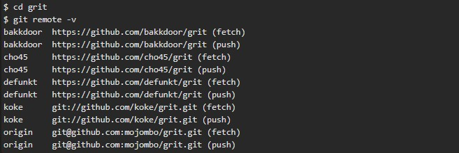
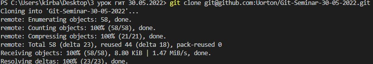
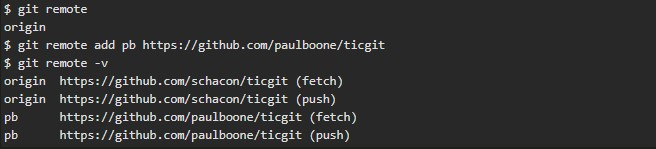
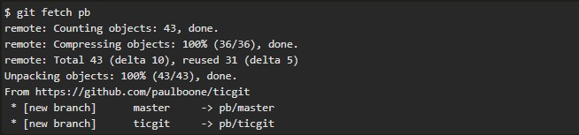

# Инструкция по работе с git и удалёнными репозиториями

## Что такое git?
*Git* одна из реализаций распредённых систем контроля версий. *Git* на данный момент является самой полулярной реализацией. Самой популярной реализацией *Git* является [GitHub](https://github.com) 

## Подготовка репозитория
Для того, чтобы создать репозиторий используется команда *git init*. Для этого необходимо написать в терминале в папке будущего репозитория *git init* 

## Создание "сохранений"
Для создания сохранения необходимо использовать команду ***git commit***. Для этого необходимо в терминале папки репозиторя написать ***git commit -m "подробное описание внесенных изменений".

### Добавление файла к коммиту

Для добавления файла к коммиту используется команда *git add*. Пишется она следующим образом *git add <имя файла>* в терминале в папке с созданным репозиторием.

### Создание коммита

Для создание нового "сохранения" испольузется команда *git commit*. Используется она следующим образом: в терминале с папкой-репозиторием пишется *git commit -m <сообщение к коммиту>*. Сообщение к коммиту писать **ОБЯЗАТЕЛЬНО**!!! 

## Журнал изменений
Для просмотра журнала измений используется команда *git log*. Для этого в терминале в папке с репозиторием достаточно написать *git log*

## Перемещение между коммитами
Для перемещения между сохранениями используется команда *git checkout*. Для того, чтобы перемиститься на указанный коммит в терминале в папке с репозиторием пишем *git checkout <номер коммита>*. **Номер коммита** берется из журнала изменений, о котором сказано выше. После перемещния на указанный коммит мы попадаем в состояние **detached head*. Чтобы вернуться к обычной работе, необходимо написать *git checkout master*.

## Ветки в git
Ветки в *git* нужны, чтобы работать с "чистовиком" и "черновиками". Для того, чтобы создать новую ветку используется команда *git branch*. В терминале в папке с репозиторием, напишите *git branch <название ветки>*.

## Слияние веток и разрешение конфликтов
Для слияния двух веток используется команда *git merge*. Для её использования необходимо перейти в ту веку, куда Вы хотите сделать слияние, после чего в терминале в папке с репозиторием написать *git merge <название сливаемой ветки>*. Чаще всего слияние проиходит автоматически, но возможны **КОНФЛИКТЫ**. В таком случае, необходимо вручную получить желаемую версию файла и сделать коммит.

## Удаление веток
Для удаления ветки используется команда *git branch -d*. Для этого необходимо в папке с репозиторием в терминале написать *git branch -d <название ветки>*. Удаляемая ветка **ОБЯЗАТЕЛЬНО** должна быть **СЛИТА**

## Получение удалённого репозитория

### Просмотр и клонирование удаленных репозиториев.
Для того, чтобы просмотреть список настроенных удалённых репозиториев, вы можете запустить команду *git remote*. Она выведет названия доступных удалённых репозиториев. Вы можете также указать ключ -v, чтобы просмотреть адреса для чтения и записи, привязанные к репозиторию, выглядеть это будет так:  
*git remote -v*.

Если у вас больше одного удалённого репозитория, команда выведет их все.  
Например, для репозитория с несколькими настроенными удалёнными репозиториями в случае совместной работы нескольких пользователей, вывод команды может выглядеть примерно так:

Это означает, что мы можем легко получить изменения от любого из этих пользователей. Возможно, что некоторые из репозиториев доступны для записи и в них можно отправлять свои изменения, хотя вывод команды не даёт никакой информации о правах доступа.

Обратите внимание на разнообразие протоколов, используемых при указании адреса удалённого репозитория.
***
Если вы хотите клонировать репозиторий, вам необходимо прописать команду **git clone <URL-адрес>**. Когда вы клонировали репозиторий, то увидите как минимум origin — имя по умолчанию, которое Git даёт серверу, с которого производилось клонирование:  

***
### Добавление удаленных репозиториев.
В предыдущих разделах мы уже упоминали и приводили примеры добавления удалённых репозиториев, сейчас рассмотрим эту операцию подробнее. Для того, чтобы добавить удалённый репозиторий и присвоить ему имя (shortname), просто выполните команду *git remote add "shortname" "url"*:

Теперь вместо указания полного пути вы можете использовать pb. Например, если вы хотите получить изменения, которые есть у Пола, но нету у вас, вы можете выполнить команду *git fetch pb*:

Ветка master из репозитория Пола сейчас доступна вам под именем pb/master. Вы можете слить её с одной из ваших веток или переключить на неё локальную ветку, чтобы просмотреть содержимое ветки Пола.

## Скачивание изменений с удалённого репозитория

Как вы только что узнали, для получения данных из удалённых проектов, следует выполнить команду **git fetch [remote-name]**.  
Данная команда связывается с указанным удалённым проектом и забирает все те данные проекта, которых у вас ещё нет. После того как вы выполнили команду, у вас должны появиться ссылки на все ветки из этого удалённого проекта, которые вы можете просмотреть или слить в любой момент.

Когда вы клонируете репозиторий, команда **git clone** автоматически добавляет этот удалённый репозиторий под именем «origin». Таким образом, **git fetch origin** извлекает все наработки, отправленные на этот сервер после того, как вы его клонировали (или получили изменения с помощью fetch). Важно отметить, что команда git fetch забирает данные в ваш локальный репозиторий, но не сливает их с какими-либо вашими наработками и не модифицирует то, над чем вы работаете в данный момент. Вам необходимо вручную слить эти данные с вашими, когда вы будете готовы.

Если ветка настроена на отслеживание удалённой ветки, то вы можете использовать команду **git pull** чтобы автоматически получить изменения из удалённой ветки и слить их со своей текущей. Этот способ может для вас оказаться более простым или более удобным. К тому же, по умолчанию команда **git clone** автоматически настраивает вашу локальную ветку master на отслеживание удалённой ветки *master* на сервере, с которого вы клонировали репозиторий. Название веток может быть другим и зависит от ветки по умолчанию на сервере. Выполнение **git pull**, как правило, извлекает *fetch* данные с сервера, с которого вы изначально клонировали, и автоматически пытается слить *merge* их с кодом, над которым вы в данный момент работаете.

## Отправка изменений в удалённый репозиторий
Когда вы хотите поделиться своими наработками, вам необходимо отправить их в удалённый репозиторий. Команда для этого действия простая:  
 **git push "remote-name" "branch-name"**. Чтобы отправить вашу ветку *master* на сервер *origin* (повторимся, что клонирование обычно настраивает оба этих имени автоматически), вы можете выполнить следующую команду для отправки ваших коммитов:  
 **git push origin master**.  
 Эта команда срабатывает только в случае, если вы клонировали с сервера, на котором у вас есть права на запись, и если никто другой с тех пор не выполнял команду **push**. Если вы и кто-то ещё одновременно клонируете, затем он выполняет команду **push**, а после него выполнить команду **push** попытаетесь вы, то ваш **push** точно будет отклонён. Вам придётся сначала получить изменения и объединить их с вашими и только после этого вам будет позволено выполнить push. Обратитесь к главе Ветвление в Git для более подробного описания, как отправлять изменения на удалённый сервер.